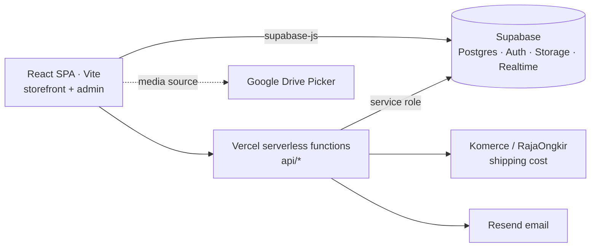

<div align="center">

# 🛍️ Nayea

**Premium modest-fashion e-commerce: a mobile-first storefront and a full admin dashboard, running on React and Supabase.**

[](https://nayea.id)


</div>

---

## Overview

Nayea is a direct-to-consumer store for hijabs, mukena and modest fashion. It is designed to feel like a boutique fashion label rather than a generic marketplace, and to earn customer trust even though payment is by manual bank transfer.

- **Storefront**: browse, add to cart or wishlist, check out with accurate shipping costs, then upload proof of payment.
- **Admin dashboard**: products, orders, payment verification, vouchers, banners, invoices, documents and live customer chat. No external tools are needed.

## Features

### Storefront
- **Home** with an auto-rotating hero (image or video), featured products and newsletter signup
- **Catalog and product detail**: image and video gallery, colour variants, pre-order status, reviews
- **Cart and wishlist** per user, with cart items unique per product and colour
- **Checkout**: saved addresses, real-time shipping cost by destination and weight, vouchers, and payment-proof upload
- **Accounts**: email/password and OAuth via Supabase Auth, password reset, profile and order history
- **Live chat widget** with realtime delivery and read receipts (sent → delivered → read)
- SEO component, generated `sitemap.xml`, and pages for FAQ, shipping, privacy and terms

### Admin
- **Dashboard** with operational stats
- **Products**: CRUD with images, video, colours, material, weight and pre-order flag. Media can be imported from **Google Drive**, and large videos are **compressed in the browser with ffmpeg.wasm** before upload.
- **Orders**: `pending → paid → shipped / cancelled`, with printable invoices
- **Payments**: verify transfer proofs (`unpaid → pending_verification → paid`)
- **Vouchers, banners and documents** management
- **Chat inbox** to reply to customers in real time
- **User management** (superadmin only): promote or demote admins through a server-side endpoint

### Transactional email
Order confirmation and shipping notification emails are sent through **Resend** from serverless functions. Email is opt-in: without an API key, the endpoints skip sending instead of failing.

## Architecture



- **Security first**: Row Level Security on every table, with staff policies going through the `public.is_staff()` SQL helper. A signup trigger forces every new user to `customer`, so nobody can grant themselves admin. The service-role key only lives in serverless functions.
- **Secrets stay server-side**: the shipping and email API keys are only used inside `api/` functions, never in the client bundle.
- **Design system**: every colour and font token lives in a single Tailwind v4 `@theme` block in `src/index.css`, and components never hardcode hex values.

### Data model

| Table | Purpose |
|---|---|
| `products` | Catalogue: price, stock, pre-order, images, video, colours, material, weight |
| `cart_items`, `wishlists` | Per-user cart (per product and colour) and saved products |
| `orders`, `order_items` | Customer, address, courier, shipping cost, order and payment status, proof of payment |
| `addresses` | Saved shipping addresses |
| `vouchers` | Discount codes |
| `reviews` | Product reviews |
| `banners` | Hero banners (image or video, link, active flag) |
| `messages` | Realtime chat (`REPLICA IDENTITY FULL`) |
| `notifications`, `admin_documents` | Admin notifications and documents |

The full schema and RLS policies are in [`supabase/schema.sql`](supabase/schema.sql).

## Project Structure

```
src/
  components/   auth (LoginModal, ProtectedRoute) · chat (ChatWidget) · layout · SEO
  context/      AuthContext, CartContext
  lib/          supabase client, roles, Google Drive picker, video compression
  pages/
    storefront/ Home, Catalog, ProductDetail, Cart, Checkout, Wishlist, Profile, …
    admin/      Dashboard, Products, Orders, Payments, Vouchers, Banners, Documents, Chat, Users
    auth/       OAuth callback
  services/     api.js (Supabase queries), shipping.js
api/            Vercel functions: shipping cost/destination, order emails, admin roles, sitemap
supabase/       schema.sql (tables + RLS) and a shipping Edge Function
docs/           PRD.md (product and design system), SRS.md (technical requirements)
```

## Getting Started

**Requirements:** Node.js 18+ and a Supabase project.

```bash
npm install
cp .env.example .env   # then fill in the values (see below)
npm run dev
```

| Variable | Scope | Purpose |
|---|---|---|
| `VITE_SUPABASE_URL`, `VITE_SUPABASE_PUBLISHABLE_KEY` | client | Supabase connection |
| `SUPABASE_SERVICE_ROLE_KEY` | server only | Superadmin user management |
| `KOMERCE_API_KEY`, `KOMERCE_ORIGIN_ID` | server only | Shipping cost and destination lookup |
| `RESEND_API_KEY` | server only, optional | Order and shipping emails |
| `VITE_GOOGLE_CLIENT_ID`, `VITE_GOOGLE_API_KEY`, `VITE_GOOGLE_DRIVE_FOLDER_ID` | client, optional | "Import from Drive" in the admin |

Apply the database schema by running [`supabase/schema.sql`](supabase/schema.sql) in the Supabase SQL editor.

```bash
npm run lint      # ESLint
npm run build     # production build
npm run preview   # serve the build locally
```

Deployment targets **Vercel**. [`vercel.json`](vercel.json) rewrites SPA routes to `index.html` and serves `/sitemap.xml` from a function.

## Documentation

- [docs/PRD.md](docs/PRD.md): brand, features, design system and tone of voice (Indonesian)
- [docs/SRS.md](docs/SRS.md): architecture, data model, authorization and non-functional requirements (Indonesian)

## Author

**Efrino Wahyu Eko Pambudi**: [GitHub](https://github.com/efrino) · [LinkedIn](https://www.linkedin.com/in/efrinowep/) · [Portfolio](https://efrino.netlify.app)
